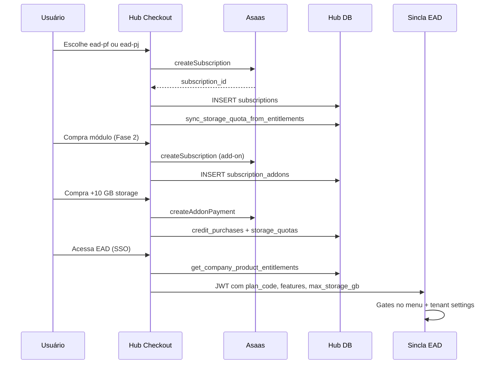

# Sincla EAD — Modelo de Precificação e Cobrança

> Documento interno · Hub (sincla-hub) · Produto `ead`  
> Última atualização: 2026-06-24

---

## 1. Resumo executivo

O EAD usa **3 camadas de receita**, sem limite de cursos ou alunos:

| Camada | O quê | Como cobra |
|--------|-------|------------|
| **Base** | Acesso à plataforma (PF ou PJ) | Assinatura mensal/anual |
| **Módulos** | Engajamento, Profissional ou Completo | Add-on recorrente |
| **Consumo** | Storage CDN/stream + tokens IA | Pay-as-you-go / pacotes |
| **Receita do cliente** | Vendas de curso via checkout EAD | Taxa % (Asaas split) |

**Princípio:** quanto mais conteúdo e features usa, mais paga — sem teto artificial de alunos.

---

## 2. Planos base (assinatura principal)

Registrados em `product_plans` com `plan_kind = 'base'`.

| Slug | Público | Doc | Mensal | Anual | Storage incl. | Banda incl./mês | Taxa vendas |
|------|---------|-----|--------|-------|---------------|-----------------|-------------|
| `ead-pf` | Infoprodutor (CPF) | PF | R$ 97 | R$ 970 | 25 GB | 100 GB | 5,99% |
| `ead-pj` | Empresa (CNPJ) | PJ | R$ 197 | R$ 1.970 | 100 GB | 500 GB | 3,99% |

> **Banda (entrega de vídeo)** é o maior custo real do CDN. Cada plano inclui uma franquia
> mensal (`limits.bandwidth_gb`); excedente cobrado por GB (medição via stats do Bunny — em implantação).

### Incluído em ambos (sem limite)

- Cursos, módulos, aulas e alunos **ilimitados**
- Certificados, checkout, vitrine, personalização básica
- Player, progresso, comentários em aula

### Diferença PF × PJ

- **PF:** entrada acessível, taxa maior, menos storage
- **PJ:** posicionamento corporativo, taxa menor, mais storage, multi-admin

### Checkout Hub

```
/checkout?produto=ead&plano=ead-pf&ciclo=monthly
/checkout?produto=ead&plano=ead-pj&ciclo=annual
```

Validação no checkout: CPF só pode contratar `ead-pf`; CNPJ só `ead-pj` (implementar Fase 2).

---

## 3. Módulos premium (add-ons)

Registrados em `product_plans` com `plan_kind IN ('addon', 'bundle')`.  
Cobrança em **`subscription_addons`** (paralelo à assinatura base).

| Slug | Tipo | Mensal | Anual | Libera |
|------|------|--------|-------|--------|
| `ead-engajamento` | addon | R$ 79 | R$ 790 | Comunidade, gamificação, quizzes avançados |
| `ead-profissional` | addon | R$ 79 | R$ 790 | Domínio, API, webhooks, automações |
| `ead-completo` | bundle | R$ 139 | R$ 1.390 | Todos os módulos acima |

### Regras de negócio

1. Cliente **precisa** de assinatura base ativa em `subscriptions` para contratar add-ons.
2. `ead-completo` **substitui** engajamento + profissional (não contratar os 3 juntos).
3. Trial de módulos: 7 dias (`trial_days` no plano).

### Checkout add-on (Fase 2)

```
/checkout?produto=ead&plano=ead-engajamento&ciclo=monthly&tipo=modulo
```

→ Cria linha em `subscription_addons`, não em `subscriptions`.

---

## 4. Consumo (storage e IA)

### Storage

| Item | Preço | R$/GB | Tabela |
|------|-------|-------|--------|
| Incluído no plano | 25 GB (PF) / 100 GB (PJ) | — | `product_plans.limits.storage_gb` |
| GB avulso (slider UI) | R$ 1,00/GB | R$ 1,00 | `service_pricing` |
| Pacote +10 GB/mês | R$ 9 | R$ 0,90 | `service_pricing` |
| Pacote +50 GB/mês | R$ 40 | R$ 0,80 | `service_pricing` |
| Pacote +200 GB/mês | R$ 140 | R$ 0,70 | `service_pricing` |

> Custo base de storage ≈ R$ 0,50/GB. Pacotes maiores = desconto por volume (R$/GB cai).
> **Custo unitário** em `service_usage_log` é gravado **por byte** (precisão `numeric(24,18)`);
> os totais `total_cost_brl`/`total_resale_brl` são colunas geradas e calculadas por trigger
> `compute_service_usage_cost` a partir de `service_pricing` (fonte única). Corrige o bug de custo zerado.

Quota efetiva: `storage_quotas` (Hub).  
Sincronização mínima do plano: RPC `sync_storage_quota_from_entitlements(company_id)`.

Checkout existente:

```
/checkout?tipo=storage&subtipo=storage&gb=10&ciclo=recorrente&valor=29.00
```

### Tokens de IA

| Opção | Preço |
|-------|-------|
| BYOK (OpenAI própria) | R$ 0 |
| Créditos Sincla (pacotes) | via `service_pricing` / `credit_purchases` |

Checkout existente:

```
/checkout?tipo=creditos&servico=ai&quantidade=1&ciclo=avulso&valor=15.00
```

---

## 5. Taxa sobre vendas (GMV)

Definida em `product_plans.limits.transaction_fee_percent`:

- **PF:** 5,99%
- **PJ:** 3,99%

Aplicada no split Asaas no checkout de curso do EAD (`FinanceiroPage` — EAD satélite).  
O percentual deve ser lido dos entitlements da empresa, não hardcoded.

---

## 6. Modelo de dados (Hub)

### Tabelas

```
products (id=ead, user_model=hybrid)
    └── product_plans
            ├── plan_kind: base | addon | bundle | legacy
            ├── account_type: pf | pj | any
            └── limits (JSONB) — storage, features, taxa

subscriptions (UNIQUE company_id + product_id)  ← plano BASE
subscription_addons (UNIQUE company_id + product_id + plan_id)  ← módulos

storage_quotas — bytes de quota CDN/stream
company_credits / credit_purchases — IA e notificações
service_pricing — preços unitários de consumo
```

### RPC principal

```sql
SELECT get_company_product_entitlements('<company_uuid>', 'ead');
```

Retorno exemplo:

```json
{
  "active": true,
  "plan_code": "ead-pj",
  "account_type": "pj",
  "storage_gb_included": 20,
  "transaction_fee_percent": 3.99,
  "unlimited_courses": true,
  "unlimited_students": true,
  "features": {
    "community": true,
    "gamification": false,
    "quizzes_advanced": true,
    "custom_domain": false,
    "api": false,
    "webhooks": false,
    "automations": false
  },
  "addons": ["ead-engajamento"]
}
```

### Migration

Arquivo: `app/supabase/migrations/20260624170000_ead_pricing_model.sql`

---

## 7. Fluxo de cobrança (end-to-end)



---

## 8. SSO → EAD (payload JWT)

Edge Function: `generate-cross-token`  
Arquivo local: `app/supabase/functions/generate-cross-token/index.ts`

Campos relevantes para o EAD:

| Campo JWT | Origem | Uso no EAD |
|-----------|--------|------------|
| `plan_code` | entitlements | `tenants.plan_code` |
| `max_storage_gb` | entitlements | quota / UI |
| `community_enabled` | features.community | menu Comunidade |
| `gamification_enabled` | features.gamification | menu Gamificação |
| `api_enabled` | features.api | Integrações/API |
| `entitlements` | RPC completo | debug / futuro |
| `transaction_fee_percent` | entitlements | split vendas |

**Deploy pendente:** `supabase functions deploy generate-cross-token` (requer autorização).

---

## 9. Planos legados

Planos antigos desativados para **novas vendas** (`is_active = false`, `plan_kind = legacy`):

| Slug | Status |
|------|--------|
| `starter` | Legacy — assinantes existentes mantidos |
| `pro` | Legacy |
| `business` | Legacy |

### Migração de clientes legados

1. Comunicar novo modelo (sem limite de aluno, storage por consumo).
2. Oferecer upgrade PF/PJ com crédito proporcional.
3. Atualizar `subscriptions.plan_id` para UUID do novo plano.
4. Rodar `sync_storage_quota_from_entitlements(company_id)`.

---

## 10. Roadmap de implementação

### ✅ Fase 0 — Base de dados (concluída)

- [x] Colunas `plan_kind`, `account_type` em `product_plans`
- [x] Tabela `subscription_addons`
- [x] RPC `get_company_product_entitlements`
- [x] RPC `sync_storage_quota_from_entitlements`
- [x] Seed planos PF/PJ + módulos
- [x] Pacotes storage em `service_pricing`
- [x] Hub Subscriptions filtra só `plan_kind = base`

### ✅ Fase 1 — SSO e gates (concluída)

- [x] Deploy `generate-cross-token` atualizado (Hub v21, com entitlements no JWT)
- [x] Migration EAD `tenant_entitlements` — colunas em `tenants`
- [x] Deploy `sso-login` v12 — sincroniza `plan_code`, `feature_flags`, `hub_addons`
- [x] EAD (código): gates no `AdminLayout` (cadeado + CTA upgrade)
- [x] EAD (código): página **Seu plano** (`/admin/seu-plano`)
- [ ] Teste SSO Hub → EAD com tenant sem add-on (comunidade bloqueada)

### 📋 Fase 2 — Checkout de módulos

- [ ] Checkout `tipo=modulo` → `subscription_addons`
- [ ] Validação CPF/CNPJ vs `account_type` do plano
- [ ] Webhook Asaas: ativar/cancelar add-on
- [ ] Exclusividade: completo vs engajamento+profissional

### 📋 Fase 3 — Consumo fluido

- [ ] Alinhar `ConsumptionDashboard` com pacotes R$ 29 / R$ 99
- [ ] Trigger pós-assinatura: `sync_storage_quota_from_entitlements`
- [ ] EAD: taxa de vendas dinâmica via entitlements
- [ ] Alertas 80%/100% storage

### 📋 Fase 4 — Comercial

- [ ] Landing `/ead` com matriz PF/PJ
- [ ] Calculadora upgrade PF → PJ (economia na taxa)
- [ ] Bundle Hub RH + EAD

---

## 11. URLs de referência rápida

| Ação | URL |
|------|-----|
| Assinar PF | `/checkout?produto=ead&plano=ead-pf&ciclo=monthly` |
| Assinar PJ | `/checkout?produto=ead&plano=ead-pj&ciclo=monthly` |
| +10 GB storage | `/checkout?tipo=storage&subtipo=storage&gb=10&ciclo=recorrente&valor=29.00` |
| Créditos IA | `/checkout?tipo=creditos&servico=ai&quantidade=1&ciclo=avulso&valor=15.00` |
| Gerenciar assinatura | `/painel/assinaturas?produto=ead` |
| Consumo | `/painel/consumo` |

---

## 12. Administração

### Conceder módulo manualmente (suporte)

```sql
INSERT INTO subscription_addons (company_id, product_id, plan_id, status, billing_cycle, monthly_amount)
SELECT
  '<company_uuid>',
  'ead',
  pp.id,
  'active',
  'monthly',
  pp.price_monthly
FROM product_plans pp
WHERE pp.product_id = 'ead' AND pp.slug = 'ead-engajamento'
ON CONFLICT (company_id, product_id, plan_id) DO UPDATE SET status = 'active', updated_at = NOW();
```

### Ver entitlements

```sql
SELECT get_company_product_entitlements('<company_uuid>', 'ead');
```

### Sincronizar storage

```sql
SELECT sync_storage_quota_from_entitlements('<company_uuid>', 'ead');
```

---

## 13. Decisões de produto registradas

1. **Sem limite de curso/aluno** — diferencial comercial.
2. **Dois planos base apenas** — PF R$ 97, PJ R$ 197.
3. **Dois módulos + bundle** — simplicidade na decisão de compra.
4. **Storage e IA separados** — cobrança por consumo real.
5. **Taxa menor no PJ** — incentiva formalização e B2B.

---

*Referências: `docs/sdk-servicos-centralizados.md`, `tools/ead/src/services/tenantSettings.ts`*
