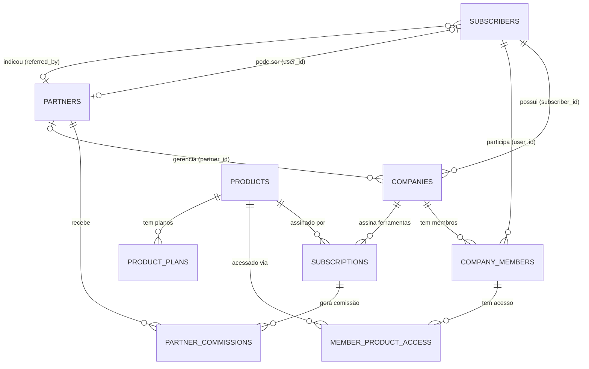

# Sincla Hub — Hierarquia de Usuários e Permissões

> Última atualização: 22/02/2026

## Modelo de Dados



## Tipos de Usuário

### 1. Assinante (Subscriber)
- Pessoa que se cadastra e paga
- Pode criar múltiplas empresas
- É automaticamente **owner** de cada empresa que cria
- **Acesso total** (advanced) a todas as ferramentas de suas empresas

### 2. Membro (Company Member)
- Usuário convidado para uma empresa
- Role na empresa: `owner` | `admin` | `manager` | `member`
- Acesso a ferramentas controlado por `member_product_access`
- Nível de acesso por ferramenta: **Avançado** ou **Básico**

### 3. Parceiro/Consultor (Partner)
- Um subscriber que também atua como consultor
- Pode gerenciar empresas de outros assinantes
- **Acesso avançado** automático a todas as ferramentas das empresas que gerencia
- Pode ser indicador (afiliado) com comissões recorrentes

## Cenário Completo

```
João (Subscriber + Owner)
├── Empresa A — Farmácia
│   ├── Sincla RH (assinado)
│   │   ├── João ........... advanced (owner)
│   │   ├── Fernando ....... basic
│   │   ├── Maria .......... advanced
│   │   └── Guilherme ...... advanced (partner)
│   │
│   └── Sincla EAD (assinado)
│       ├── João ........... advanced (owner)
│       ├── Fernando ....... advanced
│       ├── Maria .......... advanced
│       └── Guilherme ...... advanced (partner)
│
└── Empresa B — Loja de Roupas
    └── Sincla RH (assinado)
        ├── João ........... advanced (owner)
        └── Guilherme ...... advanced (partner)

Guilherme (Subscriber + Partner)
├── affiliate_code: "GUIL4832"
├── commission_percent: 10%
└── Gerencia: Empresa A, Empresa B
```

## Níveis de Acesso por Ferramenta

| Nível | Slug | Descrição |
|-------|------|-----------|
| **Avançado** | `advanced` | Acesso total: criação, edição, exclusão, configurações |
| **Básico** | `basic` | Acesso limitado: visualização e operações simples |

## Fluxo de Verificação de Permissão

Quando um usuário tenta acessar uma ferramenta em uma empresa:

```
1. A empresa tem assinatura ativa da ferramenta?
   └── NÃO → Sem acesso (subscription_active: false)

2. O usuário é o DONO da empresa? (subscriber_id)
   └── SIM → access_level: advanced, granted_by: owner

3. O usuário é PARCEIRO/CONSULTOR da empresa? (partner_id)
   └── SIM → access_level: advanced, granted_by: partner

4. O usuário é MEMBRO ativo da empresa?
   └── SIM → Verifica member_product_access
       ├── Tem registro → access_level: advanced|basic, granted_by: member
       └── Não tem registro → Sem acesso a esta ferramenta

5. Nenhum vínculo → Sem acesso
```

## Tabelas do Schema

### Camada 1 — Identidade
| Tabela | Chave | Descrição |
|--------|-------|-----------|
| `subscribers` | `id` (= auth.users.id) | Usuários da plataforma |
| `admin_users` | `id` (= auth.users.id) | Super admins do hub |

### Camada 2 — Multi-tenant
| Tabela | Chave | Descrição |
|--------|-------|-----------|
| `companies` | `id` (UUID) | Empresas com branding, slug, status |
| `company_members` | `company_id + user_id` | Vínculo membro ↔ empresa (unique) |

### Camada 3 — Produtos e Assinaturas
| Tabela | Chave | Descrição |
|--------|-------|-----------|
| `products` | `id` (VARCHAR: rh, ead...) | Catálogo de ferramentas |
| `product_plans` | `product_id + slug` | Planos por ferramenta (starter, pro, business) |
| `subscriptions` | `company_id + product_id` | Assinatura ativa por empresa (unique) |
| `plan_features` | `slug` | Features que podem ser ativadas por plano |
| `plan_feature_values` | `plan_id + feature_id` | Valores de features |

### Camada 4 — Permissões
| Tabela | Chave | Descrição |
|--------|-------|-----------|
| `member_product_access` | `company_member_id + product_id` | Nível de acesso: advanced / basic |

### Camada 5 — Parceiros
| Tabela | Chave | Descrição |
|--------|-------|-----------|
| `partners` | `user_id` (unique) | Consultores com affiliate_code |
| `partner_commissions` | `partner_id + subscription_id` | Comissões recorrentes |

### Camada 6 — Integrações
| Tabela | Chave | Descrição |
|--------|-------|-----------|
| `contacts` | `company_id` | Contatos centralizados |
| `sync_settings` | `company_id + product_id` | Config de sincronização |
| `sync_logs` | `company_id + product_id` | Log de sincronizações |
| `api_tokens` | `company_id + product_id` | Tokens de API |

## Edge Functions

| Função | Propósito |
|--------|-----------|
| `check-permission` | Verifica acesso: owner → partner → member |
| `check-subscription` | Verifica se empresa tem assinatura ativa |
| `billing-webhook` | Recebe eventos Stripe/Asaas → atualiza subscriptions |
| `generate-cross-token` | Gera token SSO para ferramentas satélite |
| `validate-cross-token` | Valida token SSO recebido |
| `get-company-branding` | Retorna branding (logo, cores) da empresa |
| `sync-contacts` | Sincroniza contatos entre hub e ferramentas |

## Funções SQL

| Função | Input | Output | Descrição |
|--------|-------|--------|-----------|
| `check_user_product_access` | user_id, company_id, product_id | `'advanced'` / `'basic'` / `NULL` | Verifica acesso cascata |
| `company_has_active_subscription` | company_id, product_id | `BOOLEAN` | Assinatura ativa? |
| `generate_affiliate_code` | partner_name | `TEXT` (ex: GUIL4832) | Código de afiliado único |
| `handle_new_user` | (trigger) | — | Cria subscriber ao cadastrar |
| `handle_new_company` | (trigger) | — | Cria member owner ao criar empresa |
| `generate_unique_slug` | base_name | `TEXT` | Slug único para empresa |
