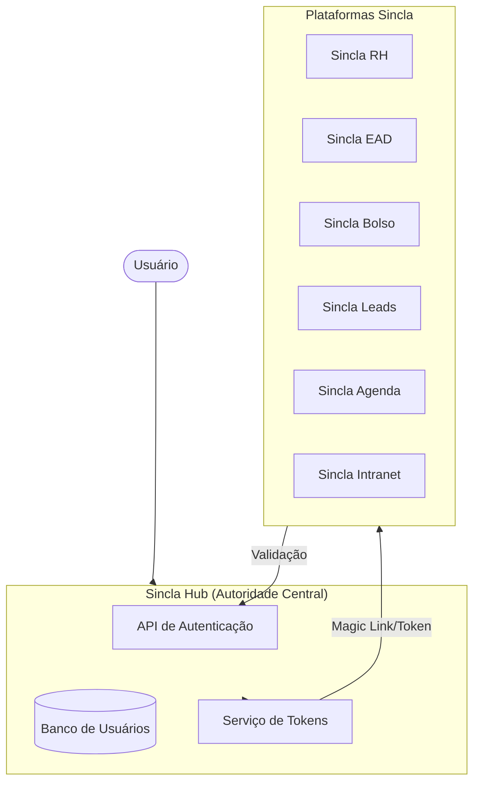
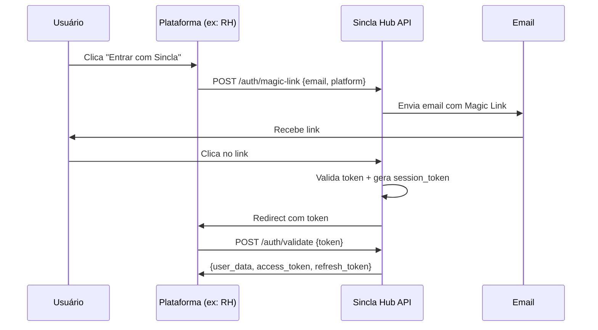
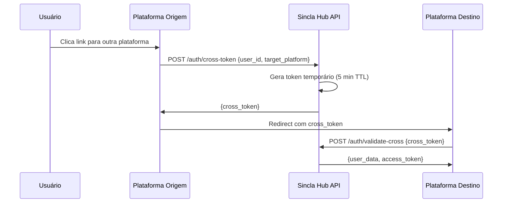

# Sincla SSO - Autenticação Unificada entre Plataformas

## Visão Geral

Este documento descreve os requisitos e especificações para integrar a autenticação unificada (Single Sign-On) entre todas as plataformas Sincla utilizando **Magic Link** e **Token especial de validação por email**.

---

## Arquitetura do Sistema



---

## Fluxo de Autenticação

### 1. Login com Magic Link



### 2. Cross-Platform Token

Quando o usuário já está logado em uma plataforma e quer acessar outra:



---

## Requisitos por Plataforma

> [!IMPORTANT]
> Cada plataforma precisa implementar os endpoints e modificações listados abaixo para participar do SSO.

### Recursos Obrigatórios (Todas as Plataformas)

| Recurso | Descrição |
|---------|-----------|
| **Botão "Entrar com Sincla"** | UI com redirect para Hub ou Magic Link |
| **Endpoint de callback** | `GET /auth/sincla/callback?token=...` |
| **Validação de token** | Chamada ao Hub para validar token recebido |
| **Sincronização de perfil** | Atualizar perfil local com dados do Hub |
| **Logout propagado** | Invalidar sessão quando Hub notificar |

---

## API do Sincla Hub

### Endpoints de Autenticação

#### `POST /api/auth/magic-link`

Solicita envio de Magic Link para email.

**Request:**
```json
{
  "email": "usuario@email.com",
  "platform": "rh",
  "callback_url": "https://rh.sincla.com.br/auth/callback"
}
```

**Response:**
```json
{
  "success": true,
  "message": "Link de acesso enviado para seu email"
}
```

---

#### `POST /api/auth/validate`

Valida token de Magic Link ou Cross-Platform.

**Request:**
```json
{
  "token": "eyJhbGciOiJIUzI1NiIs...",
  "platform": "rh"
}
```

**Response:**
```json
{
  "valid": true,
  "user": {
    "id": "uuid",
    "email": "usuario@email.com",
    "name": "Nome do Usuário",
    "avatar_url": "https://...",
    "platforms": ["rh", "ead", "bolso"]
  },
  "access_token": "jwt...",
  "refresh_token": "jwt...",
  "expires_in": 3600
}
```

---

#### `POST /api/auth/cross-token`

Gera token para navegação entre plataformas.

**Request:**
```json
{
  "user_id": "uuid",
  "source_platform": "rh",
  "target_platform": "ead"
}
```

**Response:**
```json
{
  "cross_token": "temp_token...",
  "expires_at": "2026-01-07T21:00:00Z",
  "redirect_url": "https://ead.sincla.com.br/auth/sincla/callback"
}
```

---

#### `POST /api/auth/logout`

Logout global de todas as plataformas.

**Request:**
```json
{
  "user_id": "uuid",
  "platform": "rh"
}
```

**Webhook enviado para outras plataformas:**
```json
{
  "event": "user.logout",
  "user_id": "uuid",
  "timestamp": "2026-01-07T20:00:00Z"
}
```

---

## Checklist por Plataforma

### Sincla RH

- [ ] Adicionar botão "Entrar com Sincla" na tela de login
- [ ] Implementar rota `/auth/sincla/callback`
- [ ] Integrar validação de token com Hub API
- [ ] Mapear `hub_user_id` no banco local (`user_profiles`)
- [ ] Webhook para logout propagado
- [ ] Expor endpoint para consulta de status da integração

**Contato técnico necessário:** `rh@sincla.com.br`

---

### Sincla EAD

- [ ] Adicionar botão "Entrar com Sincla" na tela de login
- [ ] Implementar rota `/auth/sincla/callback`
- [ ] Integrar validação de token com Hub API
- [ ] Mapear `hub_user_id` no banco local
- [ ] Sincronizar dados de cursos/progresso com perfil Hub
- [ ] Webhook para logout propagado

**Contato técnico necessário:** `ead@sincla.com.br`

---

### Sincla Bolso

- [ ] Adicionar botão "Entrar com Sincla" na tela de login
- [ ] Implementar rota `/auth/sincla/callback`
- [ ] Integrar validação de token com Hub API
- [ ] Mapear `hub_user_id` no banco local
- [ ] **Especial:** Sincronizar assinatura para desconto de 50% (colaboradores enterprise)
- [ ] Webhook para logout propagado

**Contato técnico necessário:** `bolso@sincla.com.br`

---

### Sincla Leads

- [ ] Adicionar botão "Entrar com Sincla" na tela de login
- [ ] Implementar rota `/auth/sincla/callback`
- [ ] Integrar validação de token com Hub API
- [ ] Mapear `hub_user_id` no banco local
- [ ] Webhook para logout propagado

**Contato técnico necessário:** `leads@sincla.com.br`

---

### Sincla Agenda

- [ ] Adicionar botão "Entrar com Sincla" na tela de login
- [ ] Implementar rota `/auth/sincla/callback`
- [ ] Integrar validação de token com Hub API
- [ ] Mapear `hub_user_id` no banco local
- [ ] **Especial:** Sincronizar assinatura para desconto de 50% (colaboradores enterprise)
- [ ] Webhook para logout propagado

**Contato técnico necessário:** `agenda@sincla.com.br`

---

### Sincla Intranet

- [ ] Adicionar botão "Entrar com Sincla" na tela de login
- [ ] Implementar rota `/auth/sincla/callback`
- [ ] Integrar validação de token com Hub API
- [ ] Mapear `hub_user_id` no banco local
- [ ] **Especial:** Sincronizar com Sincla RH para dados de colaboradores
- [ ] Webhook para logout propagado

**Contato técnico necessário:** `intranet@sincla.com.br`

---

## Estrutura de Dados Compartilhada

### Tabela `hub_users` (no Sincla Hub)

```sql
CREATE TABLE hub_users (
  id UUID PRIMARY KEY DEFAULT gen_random_uuid(),
  email VARCHAR(255) UNIQUE NOT NULL,
  name VARCHAR(255),
  phone VARCHAR(20),
  avatar_url TEXT,
  
  -- Plataformas conectadas
  connected_platforms JSONB DEFAULT '[]',
  
  -- Metadados
  created_at TIMESTAMP DEFAULT NOW(),
  updated_at TIMESTAMP DEFAULT NOW(),
  last_login_at TIMESTAMP
);
```

### Campo obrigatório nas plataformas

Cada plataforma deve adicionar:

```sql
ALTER TABLE users ADD COLUMN hub_user_id UUID;
ALTER TABLE users ADD CONSTRAINT fk_hub_user 
  FOREIGN KEY (hub_user_id) REFERENCES hub_users(id) 
  ON DELETE SET NULL;
```

---

## Segurança

### Tokens

| Tipo | TTL | Uso |
|------|-----|-----|
| Magic Link Token | 15 minutos | Link enviado por email |
| Cross-Platform Token | 5 minutos | Navegação entre plataformas |
| Access Token (JWT) | 1 hora | Autenticação de API |
| Refresh Token | 30 dias | Renovação de sessão |

### Criptografia

- Tokens assinados com **HS256** ou **RS256**
- Secret key compartilhada apenas via variáveis de ambiente
- All tokens include `iss` (issuer), `aud` (audience), `exp` (expiration)

---

## Próximos Passos

1. **Hub API** - Implementar endpoints de autenticação no Sincla Hub
2. **Primeira integração** - Começar pelo Sincla RH como piloto
3. **Rollout gradual** - Integrar demais plataformas uma a uma
4. **Testes E2E** - Validar fluxo completo entre todas as plataformas
