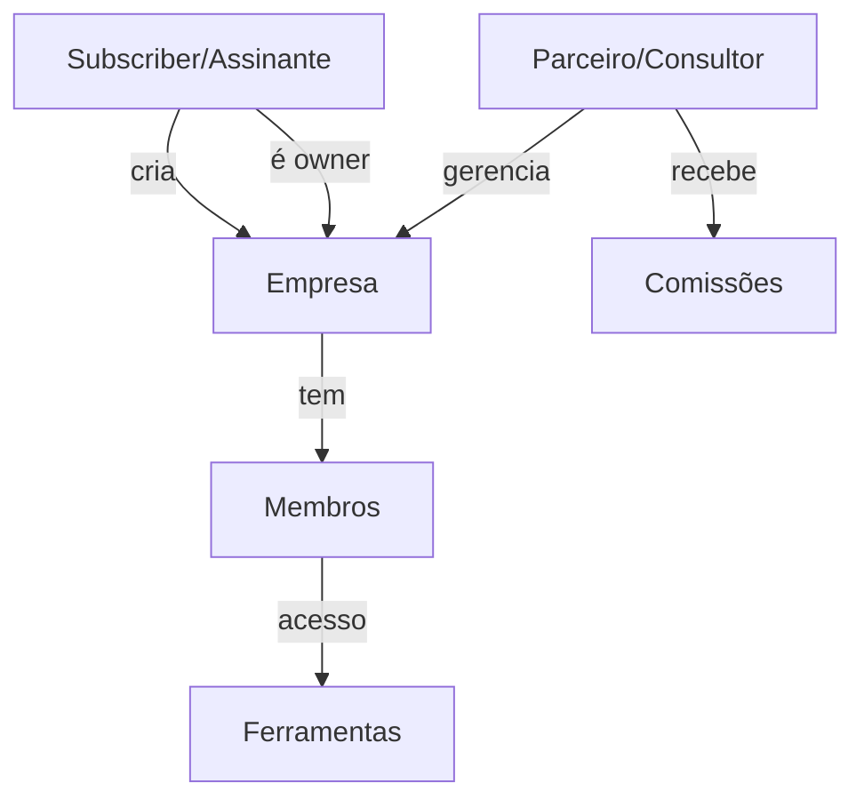

# Estudo do Projeto Sincla — O que é e o que representa

## O que é o Sincla?

O **Sincla** é um **ecossistema SaaS multi-tenant** voltado para o mercado brasileiro. Funciona como um **hub centralizado** que reúne **6 plataformas integradas** sob uma experiência unificada — similar ao modelo Atlassian (Jira + Trello + Confluence), mas com identidade própria e foco nacional.

> [!IMPORTANT]
> O Sincla não é uma ferramenta isolada — é um **ecossistema completo** com identidade dual (pessoa + empresa), SSO nativo, billing unificado e governança centralizada.

---

## As 6 Plataformas

| Plataforma | Analogia | Finalidade |
|------------|----------|------------|
| **Sincla RH** | Jira / HiBob | Gestão de pessoas |
| **Sincla EAD** | Loom / LMS | Educação corporativa |
| **Sincla Bolso** | — | Finanças pessoais |
| **Sincla Leads** | — | Conversão e captação de leads |
| **Sincla Agenda** | Trello / Cal.com | Produtividade e agendamentos |
| **Sincla Intranet** | Confluence | Comunicação interna |

---

## Arquitetura Técnica

### Monorepo Híbrido

```
sincla/
├── site/           ← Site institucional (sincla.com.br) + Dashboard + Admin
├── app/            ← Painel geral futuro (app.sincla.com.br)
├── tools/          ← Plataformas satélite (git independente)
│   ├── rh/         ← Sincla RH (510 arquivos)
│   ├── ead/        ← Sincla EAD (354 arquivos)
│   ├── bolso/      ← Sincla Bolso (154 arquivos)
│   ├── lead/       ← Sincla Leads (110 arquivos)
│   └── agenda/     ← Sincla Agenda
├── packages/       ← Bibliotecas compartilhadas (@sincla/ui, @sincla/auth, @sincla/shared)
└── docs/           ← Documentação macro (22 documentos)
```

### Stack Tecnológica

| Camada | Tecnologia |
|--------|------------|
| Frontend | **React 19** + TypeScript + **Vite 7** |
| UI | **Mantine 8** + Tabler Icons |
| Routing | react-router-dom |
| Data Fetching | TanStack Query |
| Auth | Supabase Auth |
| Database | PostgreSQL (Supabase) |
| Edge Functions | Deno (Supabase Functions) |
| Billing | Stripe + Asaas (via webhook) |

---

## Modelo de Negócio

### Proposta de Valor

- **B2B**: "Centralize gestão de pessoas, treinamentos e comunicação em um ecossistema integrado"
- **B2C**: "Suas ferramentas pessoais de produtividade, finanças e aprendizado em um só lugar, com I.A."

### Diferenciais Competitivos

1. **Integração nativa** entre todas as plataformas
2. **I.A. presente** em todas as ferramentas (Assistente Ágata)
3. **SSO + billing unificado** + painel central
4. **Descontos cruzados** de 50% para colaboradores de empresas clientes

### Estrutura de Pricing

- **Gratuito (Starter)**: 1 admin, 1 módulo, features básicas — forever free
- **Pro**: Até 10 usuários, features completas
- **Business**: Até 50 usuários, governança completa
- **Enterprise**: Ilimitado, SSO externo (SAML/OIDC), CSM dedicado

---

## Hierarquia de Usuários



### Níveis de Permissão

| Tipo | Descrição | Acesso |
|------|-----------|--------|
| **Owner** | Quem criou a empresa | Avançado automático em tudo |
| **Partner** | Consultor que gerencia empresas | Avançado automático |
| **Member** | Convidado para a empresa | Controlado por `member_product_access` |

### Fluxo de Verificação

```
Empresa tem assinatura ativa? → É owner? → É partner? → É membro com acesso? → Sem acesso
```

---

## SSO entre Plataformas

O Sincla implementa autenticação unificada via:

1. **Magic Link** — Login por email enviado ao usuário
2. **Cross-Platform Token** — Token temporário (5 min) para navegar entre plataformas sem re-login
3. **Logout propagado** — Sair do Hub encerra sessão em todas as ferramentas

---

## Edge Functions (Supabase)

| Função | Propósito |
|--------|-----------|
| `check-permission` | Verifica acesso cascata: owner → partner → member |
| `check-subscription` | Verifica assinatura ativa da empresa |
| `billing-webhook` | Recebe Stripe/Asaas → atualiza subscriptions |
| `generate-cross-token` | Gera token SSO para ferramentas satélite |
| `validate-cross-token` | Valida token SSO recebido |
| `get-company-branding` | Retorna branding (logo, cores) da empresa |
| `sync-contacts` | Sincroniza contatos entre hub e ferramentas |

---

## Personas Alvo

| Persona | Cargo/Perfil | Dor Principal |
|---------|-------------|---------------|
| **Primária** | Gestor de RH (PME 50-500 colab.) | Ferramentas fragmentadas |
| **Secundária** | Profissional autônomo | Desorganização financeira/agenda |
| **Terciária** | CEO/CFO de PME | Custos com múltiplos softwares |

---

## Estrutura de Banco (Schema)

| Camada | Tabelas | Descrição |
|--------|---------|-----------|
| Identidade | `subscribers`, `admin_users` | Usuários da plataforma |
| Multi-tenant | `companies`, `company_members` | Empresas + vínculos |
| Produtos | `products`, `product_plans`, `subscriptions`, `plan_features` | Catálogo e assinaturas |
| Permissões | `member_product_access` | Nível de acesso por ferramenta |
| Parceiros | `partners`, `partner_commissions` | Afiliados e comissões |
| Integrações | `contacts`, `sync_settings`, `sync_logs`, `api_tokens` | Sincronização entre ferramentas |

---

## Resumo

O **Sincla** é um ecossistema SaaS ambicioso que centraliza a gestão empresarial brasileira sob um hub unificado. Possui uma arquitetura bem planejada com separação clara entre site público, painel administrativo e ferramentas satélite, conectados via SSO e billing centralizado. O projeto está em fase ativa de desenvolvimento, com ferramentas como RH, EAD, Bolso e Leads já em produção.
